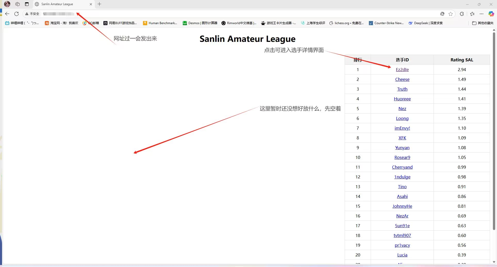
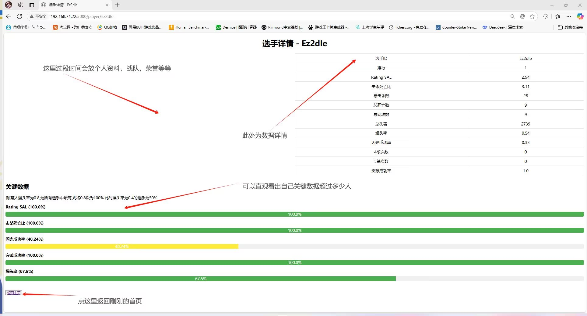

一个具有战绩计算以及显示功能的网页，建议配合MatchZy插件使用，需要pandas，os，chardet，flask库

下载的Match_Stats文件夹用于存放MatchZy插件生成的csv战绩文件

程序中有作者自创的rating计算方法，因为作者举办的比赛缩写为SAL故称为rating sal。此rating计算方法鼓励闪光弹的使用，若有更好的计算方法欢迎反馈

目前为version 1.0，有许多不完善的地方，网页仅实现了数据查询，其余部分均留空，等待添加功能，目前规划为加入demo下载，单场数据查询，比赛资讯，赛程安排等。在2025年7月前会将网页制作完毕，7月后会进行美化

另外，所有代码中的名字均为作者所举办的比赛的名字，请大家使用时注意修改

此为作者制作的第一个项目，在此之前仅学习计算机1个月，错误较多请多多包涵